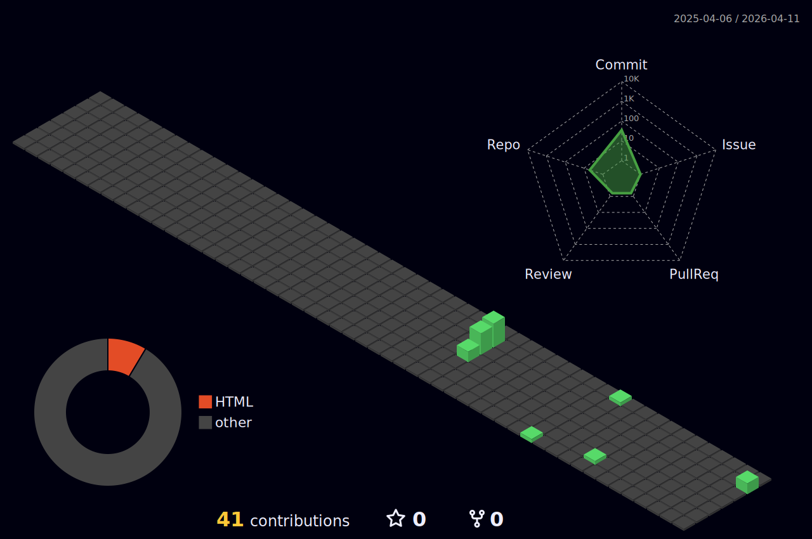

<!-- Simple Static Header -->
<h1 style="font-size: 40px; color: #fbbf24; margin: 0;">Mohamed El Rayess</h1>
<h3 style="font-size: 16px; color: #9ca3af; font-weight: 400; margin-top: 10px;">
💻 Software Engineer & Architect | 🚀 Microservices Specialist
</h3>

 

---

<!-- GitHub Statistics - Full Width -->

## 📊 GitHub Statistics

---

<!-- 3D Contribution Profile in Rounded Table -->

## 📈 3D Contribution Profile

<table style="border-radius: 10px; overflow: hidden;">
<tr>
<td align="center" bgcolor="#1f2937" style="border-radius: 10px; padding: 20px;">

</td>
</tr>
</table>

---

<!-- Technology Stack - Single Table with Yellow Theme -->

## 🛠️ Technology Stack

<table width="100%">
<tr>
<td align="center" colspan="12" bgcolor="#fbbf24" style="padding: 10px;">
<b style="font-size: 16px; color: #000000;">💻 Programming Languages & Technologies</b>
</td>
</tr>
<tr bgcolor="#1f2937">
<td align="center" width="8.33%" style="padding: 15px;">
 
JavaScript
</td>
<td align="center" width="8.33%" style="padding: 15px;">
 
TypeScript
</td>
<td align="center" width="8.33%" style="padding: 15px;">
 
Python
</td>
<td align="center" width="8.33%" style="padding: 15px;">
 
HTML5
</td>
<td align="center" width="8.33%" style="padding: 15px;">
 
CSS3
</td>
<td align="center" width="8.33%" style="padding: 15px;">
 
Angular
</td>
<td align="center" width="8.33%" style="padding: 15px;">
 
RxJS
</td>
<td align="center" width="8.33%" style="padding: 15px;">
 
Bootstrap
</td>
<td align="center" width="8.33%" style="padding: 15px;">
 
SASS
</td>
<td align="center" width="8.33%" style="padding: 15px;">
 
NestJS
</td>
<td align="center" width="8.33%" style="padding: 15px;">
 
Node.js
</td>
<td align="center" width="8.33%" style="padding: 15px;">
 
FastAPI
</td>
</tr>
<tr bgcolor="#1f2937">
<td align="center" style="padding: 15px;">
 
Express
</td>
<td align="center" style="padding: 15px;">
 
PostgreSQL
</td>
<td align="center" style="padding: 15px;">
 
MongoDB
</td>
<td align="center" style="padding: 15px;">
 
MySQL
</td>
<td align="center" style="padding: 15px;">
 
Redis
</td>
<td align="center" style="padding: 15px;">
 
Kafka
</td>
<td align="center" style="padding: 15px;">
 
RabbitMQ
</td>
<td align="center" style="padding: 15px;">
 
Docker
</td>
<td align="center" style="padding: 15px;">
 
Kubernetes
</td>
<td align="center" style="padding: 15px;">
 
Actions
</td>
<td align="center" style="padding: 15px;">
 
Nginx
</td>
<td align="center" style="padding: 15px;">
 
Git
</td>
</tr>
<tr bgcolor="#1f2937">
<td align="center" style="padding: 15px;">
 
Postman
</td>
<td colspan="11"></td>
</tr>
</table>

---

<!-- Activity Overview in Rounded Table -->

## 📊 Activity Overview

<table style="border-radius: 10px; overflow: hidden;">
<tr>
<td align="center" bgcolor="#1f2937" style="border-radius: 10px; padding: 20px;">

  

</td>
</tr>
</table>

---

<!-- Areas of Expertise - Full Width with Icons -->

## 🎯 Areas of Expertise

<table width="100%">
<tr>
<td align="center" width="33.33%" bgcolor="#fbbf24" style="padding: 10px;">
<b style="font-size: 16px; color: #000000;">🏗️ Architecture</b>
</td>
<td align="center" width="33.33%" bgcolor="#f59e0b" style="padding: 10px;">
<b style="font-size: 16px; color: #000000;">🗄️ Data & Backend</b>
</td>
<td align="center" width="33.33%" bgcolor="#d97706" style="padding: 10px;">
<b style="font-size: 16px; color: #000000;">🐳 DevOps</b>
</td>
</tr>
<tr bgcolor="#1f2937">
<td align="left" valign="top" style="padding: 20px;">

 Microservices Design

 Event-Driven Systems

 Domain-Driven Design

 API Gateway Patterns

 Service Mesh

</td>
<td align="left" valign="top" style="padding: 20px;">

 Database Design

 PostgreSQL Optimization

 NoSQL (MongoDB, Redis)

 Message Queues (Kafka)

 Caching Strategies

</td>
<td align="left" valign="top" style="padding: 20px;">

 Docker Containers

 Kubernetes Orchestration

 CI/CD Pipelines

 Infrastructure as Code

 Monitoring & Logging

</td>
</tr>
</table>

---

<!-- Contact Information - Full Width Small Font -->

## 📞 Contact Information

<table width="100%">
<tr>
<td align="center" bgcolor="#fbbf24" style="padding: 12px;">
<b style="font-size: 18px; color: #000000;">Get In Touch</b>
</td>
</tr>
<tr bgcolor="#1f2937">
<td style="padding: 25px;">
<table width="100%" border="0" cellpadding="8">
<tr>
<td align="center" width="50">

</td>
<td align="left" width="150">
<b style="font-size: 12px; color: #fbbf24;">Name</b>
</td>
<td align="left">
Mohamed El Rayess
</td>
<td align="center" width="50">

</td>
<td align="left" width="150">
<b style="font-size: 12px; color: #fbbf24;">Role</b>
</td>
<td align="left">
Software Engineer & Architect
</td>
</tr>
<tr>
<td align="center">

</td>
<td align="left">
<b style="font-size: 12px; color: #fbbf24;">Location</b>
</td>
<td align="left">
Lebanon 🇱🇧
</td>
<td align="center">

</td>
<td align="left">
<b style="font-size: 12px; color: #fbbf24;">Email</b>
</td>
<td align="left">
<a href="mailto:mohamedalrayess@gmail.com" style="font-size: 12px; color: #fbbf24; text-decoration: none;">mohamedalrayess@gmail.com</a>
</td>
</tr>
<tr>
<td align="center">

</td>
<td align="left">
<b style="font-size: 12px; color: #fbbf24;">Phone</b>
</td>
<td align="left">
+961 70 076 776
</td>
<td align="center">

</td>
<td align="left">
<b style="font-size: 12px; color: #fbbf24;">Specialization</b>
</td>
<td align="left">
Microservices Architecture Event-Driven Design Database Optimization Container Orchestration
</td>
</tr>
<tr>
<td align="center">

</td>
<td align="left">
<b style="font-size: 12px; color: #fbbf24;">Status</b>
</td>
<td align="left">
🟢 Open for Opportunities
</td>
<td colspan="3"></td>
</tr>
</table>
</td>
</tr>
<tr bgcolor="#fbbf24">
<td align="center" style="padding: 15px;">

</td>
</tr>
</table>

---

  

**✨ Building scalable systems, one microservice at a time ✨**

